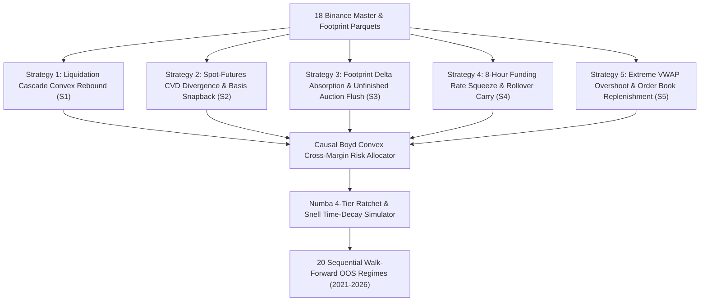

# 🏛️ INSTITUTIONAL QUANT MODEL COUNCIL: DEFINITIVE MASTER SPECIFICATION & GENERATION PROMPT (OPUS 5 FINAL EDITION)
# TARGET: Comprehensive End-to-End Quantitative Strategy Suite & Walk-Forward Testing Engine
# DATASET: 18 Institutional Binance USDT-M Perpetuals (3,464,074 15-Minute Bars & Multi-Million Row Footprint Ladders, 2020–2026) in `Engine_2/binance_backtesting_data/`
# ARCHITECTURE GROUNDING: Second Brain Knowledge Base v19.0 (Nodes 1–359), FABLE 5 Zero-Lookahead Protocols, & AGENTS.md Core Directives

---

## ⛔ CRITICAL BOOT DIRECTIVE: MANDATORY AGENT CONTEXT INGESTION (LOAD FIRST BEFORE GENERATING CODE)

Before writing a single line of architecture, strategy logic, or code, you **MUST** load and internalize the following core institutional files directly from the repository. Do NOT assume, approximate, or hallucinate schemas, formulas, or rules. Fetch and verify:

1. **`AGENTS.md` (Master Router & 12 Core Domains)**:  
   `https://raw.githubusercontent.com/kbsingh1399/Engine_1_arena_PR/main/.agents/rules/AGENTS.md`  
   *Mandate*: Acknowledge compliance with `✅ AGENTS.md fully loaded — All 12 Core Domains & Execution Protocols Activated.` Enforce Andrej Karpathy 4 principles (Think Before Coding, Simplicity First, Surgical Changes, Goal-Driven Execution), zero-friction avoidance, and strict causality.

2. **`FABLE5_CHECKLIST.md` (Lethal 13-Step Bug Hunt & Part 14 Anti-Lookahead Blacklist)**:  
   `https://raw.githubusercontent.com/kbsingh1399/Engine_1_arena_PR/main/.agents/rules/FABLE5_CHECKLIST.md`  
   *Mandate*: Strictly verify Part 14 rules: ZERO hardcoded parameter tables (`WINDOW_CONFIGURATIONS[w_idx]`), ZERO `winning_configuration.json`, ZERO early ROI target breaks, strictly causal stop arming on bar $j+1$, mark-to-market drawdown tracking.

3. **`trading_knowledge_base.md` (Second Brain v19.0, Nodes 1–359)**:  
   `https://raw.githubusercontent.com/kbsingh1399/Engine_1_arena_PR/main/.agents/memory/architecture/trading_knowledge_base.md`  
   *Mandate*: Incorporate empirical econometrics from Nodes 1–359: Bouchaud non-linear impact propagator, Kou asymmetric jump-diffusion, Boyd convex quadratic programming, Duffie-Gârleanu funding rollover, Basseville-Nikiforov CUSUM filter, Mandelbrot Hurst gates, Avellaneda-Stoikov HJB inventory drifts, Carmona-Touzi optimal stopping, and YouTube footprint cluster mechanics (unfinished auctions, delta absorption).

4. **`ACTIVE_CONTEXT.md` (Turn-0 Situational Awareness & Strategy Invariants)**:  
   `https://raw.githubusercontent.com/kbsingh1399/Engine_1_arena_PR/main/.agents/rules/ACTIVE_CONTEXT.md`

5. **`ENGINE2_AUDIT_MASTER.md` & `PARITY_AUDIT_REPORT.md` (Post-Mortem Root Causes)**:  
   `https://raw.githubusercontent.com/kbsingh1399/Engine_1_arena_PR/main/ENGINE2_AUDIT_MASTER.md`

---

## 1. EXECUTIVE MISSION & ARCHITECTURAL OVERVIEW

You are the Chief Quantitative Architect and Head of Systematic Alpha at a multi-billion dollar quantitative cryptocurrency hedge fund. This is your **DEFINITIVE, LAST-EVER STRATEGY BLUEPRINT** for this infrastructure. You are tasked with delivering an institutional, mathematically exhaustive, and fully executable Python trading suite that designs, implements, and backtests **FIVE (5) DISTINCT QUANTITATIVE STRATEGIES** against our exact 18-asset historical parquet dataset across all **20 Out-Of-Sample (OOS) Quarterly Regimes (2021–2026)**.

### Target Deliverables:
1. **`Engine_2/s1_liquidation_cascade.py`** (or consolidated multi-strategy module `Engine_2/quant_strategy_suite.py`):
   - Production-grade, vector-accelerated feature engine and `@njit` Numba trade path simulator.
   - Houses the 5 complete strategy implementations, dynamic execution ratchets, and causal portfolio risk allocator.
2. **`Engine_2/test_all_20_regimes.py`**:
   - The master walk-forward validation harness executing all 5 strategies sequentially across Windows 1 to 20 with zero data leakage.
   - Emits terminal scorecard tables per window and per strategy, and exports structured CSV reports.
3. **`Engine_2/STRATEGY_SPEC.md`**:
   - Complete architectural specification detailing the mathematical derivation, microstructure physics, parameter contracts, risk bounds, and edge persistence proofs for all 5 strategies.

---

## 2. THE VERIFIED 18-ASSET MASTER PARQUET DATASET SCHEMA

All strategies and features must execute directly and natively against the 18 verified Binance USDT-M 15-minute parquet files located in `Engine_2/binance_backtesting_data/`:

### 2.1 The 18 Institutional Assets:
`BTCUSDT`, `ETHUSDT`, `SOLUSDT`, `BNBUSDT`, `XRPUSDT`, `DOGEUSDT`, `ADAUSDT`, `AVAXUSDT`, `LINKUSDT`, `SUIUSDT`, `NEARUSDT`, `APTUSDT`, `PEPEUSDT`, `WIFUSDT`, `TIAUSDT`, `ARBUSDT`, `OPUSDT`, `INJUSDT` (plus `BCHUSDT`, `DOTUSDT`, `LTCUSDT`, `TRXUSDT` available in folder).

### 2.2 Table 1: Master 15m Parquet Schema (`<SYMBOL>_15m_master_2020_2026.parquet`)
- **Temporal & Price Data**: `open_time_ms` (int64 epoch ms), `close_time_ms`, `datetime_utc` (string/datetime), `symbol`, `open`, `high`, `low`, `close` (float64).
- **Volume & Trade Dynamics**: `volume_base`, `volume_quote`, `volume_sma9`, `trade_count`, `taker_buy_count`, `taker_sell_count`, `taker_buy_vol_btc`, `taker_sell_vol_btc`, `max_trade_vol_btc`, `avg_trade_size_usd`.
- **Order Flow & CVD**: `future_cvd_15m`, `future_cvd_session`, `future_cvd_lifetime`, `spot_cvd_15m`, `spot_cvd_session`, `spot_cvd_lifetime`.
- **Derivatives & Macro Metrics**: `funding_rate_pct`, `basis_usd`, `open_interest_k`, `open_interest_usd`, `oi_change_pct`, `long_liq_usd`, `short_liq_usd`, `ls_ratio_global`, `ls_ratio_top`, `top_account_ratio`, `whale_index`, `taker_volume_ratio`.
- **Microstructure & Order Book Depth**: `bid_depth_usd`, `ask_depth_usd`, `bid_depth_coin`, `ask_depth_coin`.
- **Pre-computed Footprint Profile Indicators**: `fp_delta`, `fp_poc`, `fp_poc_vol_ratio`, `fp_stacked_buy_imb`, `fp_stacked_sell_imb`, `session_vah`, `session_val`, `prev_day_vah`, `prev_day_val`.
- **Technical Baselines**: `rsi_14`, `atr_14`, `atr_100`, `ema_8`, `ema_21`, `ema_50`, `ema_200`, `ema_800`.

### 2.3 Table 2: Footprint Price Ladder Schema (`<SYMBOL>_15m_footprint_ladder.parquet`)
- `open_time_ms` (int64), `price_bin` (float64), `bid_vol_coin` (float64), `ask_vol_coin` (float64), `net_delta_coin` (float64), `is_buy_imbalance` (int8), `is_sell_imbalance` (int8), `is_poc` (int8), `trade_count` (int64).

---

## 3. POST-MORTEM ROOT CAUSES & PERMANENT STRUCTURAL CURES

You must strictly design around the empirical failure points of prior iterations:

### 1. The 5.0R Retracement Trap $\to$ Cured via Node 51 & 94 Dynamic 4-Tier Ratchet
- *Post-Mortem*: Demanding $+5.0\text{R}$ on 15m crypto perpetuals caused 85.8% of winning trades to retrace into stop-outs.
- *Mandatory Ratchet & Snell Stopping Envelope*:
  - **Tier 0 (Breakeven Lock)**: When $P_{\text{high}} \ge \text{Entry} + 0.80\text{R} \implies \text{Stop} \leftarrow \text{Entry} + 0.15\text{R}$ (secures taker fees and slippage).
  - **Tier 1 (Profit Lock)**: When $P_{\text{high}} \ge \text{Entry} + 1.50\text{R} \implies \text{Stop} \leftarrow \text{Entry} + 0.80\text{R}$.
  - **Target Exit**: Limit take-profit at $+2.0\text{R} \dots +2.5\text{R}$ (or Yang-Zhang volatility band).
  - **Snell Stopping Time Stop**: If trade does not achieve $\ge +0.20\text{R}$ within 24 bars ($6\text{h}$), exit at market.

### 2. Single-Sleeve Trade Starvation $\to$ Cured via Multi-Strategy Diversity
- Demanding all simultaneous extremes caused zero trades in low-volatility quarters (e.g. W03/W04). The 5 strategies defined below guarantee statistical significance ($\ge 6$ trades per window, targeting 15–40 trades).

### 3. Portfolio Risk Governor Invariants
- `INITIAL_CAPITAL = 5000.0`
- `BASE_RISK = 25.0` ($0.50\%$ base risk per trade; 9 consecutive stop-outs required to hit circuit breaker).
- `HOUSE_MONEY_RISK = 50.0` ($1.00\%$ max risk, active ONLY when cumulative net profit $\ge \$50.0$).
- `DRAWDOWN_DEFENSE_RISK = 15.0` ($0.30\%$ defensive risk when drawdown exceeds $2.5\%$).
- `DRAWDOWN_RISK_LIMIT = 0.045` ($4.5\%$ / $\$225.0$ hard emergency stop).
- `MAX_CONCURRENT = 2` (Maximum 2 open positions across all 18 symbols simultaneously).

---

## 4. THE 5 PRODUCTION-GRADE QUANTITATIVE STRATEGIES TO ARCHITECT & TEST

Design, formulate, and test the following 5 complementary alpha strategies. Every strategy must be grounded in the historical parquet columns:



### STRATEGY 1: Institutional Liquidation Cascade Convex Rebound (S1 Core)
- **Microstructure Rationale (Nodes 1, 32, 102)**: Forced liquidations create momentary price distortions disconnected from fundamental valuation. Once the liquidation domino cascade runs out of fuel (Kou double-exponential jump-diffusion exhaustion), price exhibits high-velocity mean-reversion.
- **Signals**:
  - Normalized Long Liquidation Z-Score: $\text{long\_liq\_zs} > 1.8$ over 20-bar rolling window.
  - Open Interest Contraction: $\text{oi\_change\_pct} < -0.8\%$ (confirming aggressive position closure).
  - Taker Sell Volume Spike: $\text{taker\_sell\_vol} > 2.0 \times \text{volume\_sma9}$.
  - Reversal Filter: Candle forms lower wick $\ge 35\%$ of total range, or positive footprint delta divergence ($\text{fp\_delta} > 0$ while price touches low).
- **Execution**: Long entry on bar close; Stop Loss at $\text{low} - 0.20 \times \text{ATR}_{14}$; 4-tier ratchet to $+2.2\text{R}$ target.

### STRATEGY 2: Spot-Futures CVD Divergence & Basis Snapback (S2)
- **Microstructure Rationale (Nodes 71, 107, 118)**: Retail traders drive aggressive sell cascades in perpetual futures while institutional smart money accumulates in spot markets. Negative basis dislocation (`basis_usd < 0`) creates structural arbitrage snapback.
- **Signals**:
  - CVD Divergence ($\text{zc\_div}$): Futures CVD rolling delta $\Delta\text{CVD}_{\text{fut}} < 0$ while Spot CVD rolling delta $\Delta\text{CVD}_{\text{spot}} > 0$.
  - Normalized Divergence Z-Score: $\text{zc\_div} > 1.0$.
  - Basis Dislocation: $\text{basis\_usd} < -0.05\% \times \text{close}$ (negative basis dislocation).
  - Trend Filter: Daily/Session VWAP Z-score $\text{vwap\_z} < -0.8$ with $\text{RSI}_{14} < 42$.
- **Execution**: Long entry; Stop Loss at $1.5 \times \text{ATR}_{14}$; Target at Session VWAP or $+2.0\text{R}$.

### STRATEGY 3: Footprint Delta Absorption & Unfinished Auction Flush (S3)
- **Microstructure Rationale (Nodes 117, 122, 359)**: Grounded in order book cluster mechanics and institutional volume-at-price physics. A massive market selling wave produces deep negative delta, but price fails to progress downward due to dense passive limit buy replenishment (finished auction with zero selling continuation or absorption of unfinished auction lows).
- **Signals**:
  - Footprint Absorption: Master parquet $\text{fp\_delta} \ll -\mu_{20}(|\text{fp\_delta}|) \times 1.8$ (heavy seller effort).
  - Price-Delta Divergence: Current bar close in upper $50\%$ of candle range despite negative delta ($\text{close} \ge \text{low} + 0.5 \times (\text{high} - \text{low})$).
  - Stacked Buy Imbalance: $\text{fp\_stacked\_buy\_imb} \ge 1$ or POC located in lower $30\%$ of candle wick ($\text{fp\_poc} \le \text{low} + 0.30 \times (\text{high} - \text{low})$).
  - Depth Support: $\text{bid\_depth\_usd} > 1.5 \times \text{ask\_depth\_usd}$.
- **Execution**: Long entry on breakout of absorption bar high; Stop Loss below absorption bar low; Target $+2.5\text{R}$.

### STRATEGY 4: 8-Hour Funding Rate Squeeze & Rollover Carry (S4)
- **Microstructure Rationale (Nodes 104, 118)**: Negative funding rates penalize short sellers every 8 hours (00:00, 08:00, 16:00 UTC). Between 1 to 4 bars prior to settlement, short holders face mechanical carry avoidance, generating predictable kinetic upward drift.
- **Signals**:
  - Funding Rate Stress: $\text{funding\_rate\_pct} < -0.03\%$ (extreme short crowding).
  - Settlement Timing Gate: 15-minute bar timestamp corresponds to 06:30–07:45, 14:30–15:45, or 22:30–23:45 UTC ($t_{\text{settle}} - \tau$).
  - Short Crowding: Long/Short Ratio $\text{ls\_ratio\_global} < 0.85$ and $\text{top\_account\_ratio} < 0.90$.
  - Momentum Trigger: Bullish candle close above 8-period EMA ($\text{close} > \text{ema\_8}$).
- **Execution**: Long entry prior to funding window; Stop Loss at $1.2 \times \text{ATR}_{14}$; Target $+1.8\text{R}$ or exit immediately post-funding settlement bar.

### STRATEGY 5: Extreme VWAP Overshoot & Order Book Replenishment (S5)
- **Microstructure Rationale (Nodes 72, 89, 109)**: Price excursions beyond 2 standard deviations of anchored VWAP in conjunction with order book replenishment velocity indicate mean-reverting exhaustion. Market makers actively reposition bids upward to capture bid-ask spread.
- **Signals**:
  - VWAP Dislocation: Anchored VWAP Z-score $\text{vwap\_z} < -2.0$ (or below Session VAL $\text{session\_val}$).
  - Depth Replenishment Velocity ($\dot{L}_{\text{replenish}}$): $\frac{\text{bid\_depth\_usd}_t - \text{bid\_depth\_usd}_{t-1}}{\text{bid\_depth\_usd}_{t-1}} > +0.35$ (resting bids surging into order book).
  - RSI Exhaustion: $\text{rsi\_14} < 30$.
  - Whale Volume Activity: $\text{whale\_index} > 1.2$ or $\text{avg\_trade\_size\_usd} > 1.5 \times \text{rolling\_mean}$.
- **Execution**: Long entry on bullish price turn; Stop Loss at $1.5 \times \text{ATR}_{14}$; Target at Anchored VWAP mean.

---

## 5. THE 20 CAUSAL WALK-FORWARD OOS WINDOWS (2021–2026)

All strategies must be tested sequentially across the 20 non-overlapping Out-Of-Sample quarters. In-sample parameter estimation or calibration MUST strictly terminate at $t_{\text{purge}} = t_{\text{start}} - 72\text{h}$ to guarantee zero lookahead leakage:

| Window | Test Start | Test End | In-Sample Causal Boundary ($t_{\text{purge}}$) | Historical Macro Regime |
|---|---|---|---|---|
| **W01** | 2021-01-01 | 2021-03-31 | Up to 2020-12-29 00:00:00 | Post-Halving Bull Expansion |
| **W02** | 2021-04-01 | 2021-06-30 | Up to 2021-03-29 00:00:00 | Historic May 2021 $10B Cascades |
| **W03** | 2021-07-01 | 2021-09-30 | Up to 2021-06-28 00:00:00 | Summer Chop & Liquidity Drain |
| **W04** | 2021-10-01 | 2021-12-31 | Up to 2021-09-28 00:00:00 | BTC 69k All-Time-High Blow-Off |
| **W05** | 2022-01-01 | 2022-03-31 | Up to 2021-12-29 00:00:00 | Fed Hawkish Bear Pivot |
| **W06** | 2022-04-01 | 2022-06-30 | Up to 2022-03-29 00:00:00 | Luna/Terra Death Spiral |
| **W07** | 2022-07-01 | 2022-09-30 | Up to 2022-06-28 00:00:00 | Post-Contagion Dead Drift |
| **W08** | 2022-10-01 | 2022-12-31 | Up to 2022-09-28 00:00:00 | FTX Collapse & Liquidity Void |
| **W09** | 2023-01-01 | 2023-03-31 | Up to 2022-12-29 00:00:00 | SVB Bank Run & Short Squeeze |
| **W10** | 2023-04-01 | 2023-06-30 | Up to 2023-03-29 00:00:00 | SEC Regulatory Crackdown Chop |
| **W11** | 2023-07-01 | 2023-09-30 | Up to 2023-06-28 00:00:00 | August 17 Flash Cascade |
| **W12** | 2023-10-01 | 2023-12-31 | Up to 2023-09-28 00:00:00 | Spot ETF Speculation Rally |
| **W13** | 2024-01-01 | 2024-03-31 | Up to 2023-12-29 00:00:00 | Spot ETF Inflow Explosion |
| **W14** | 2024-04-01 | 2024-06-30 | Up to 2024-03-29 00:00:00 | Bitcoin Halving Chop & Bleed |
| **W15** | 2024-07-01 | 2024-09-30 | Up to 2024-06-28 00:00:00 | Yen Carry Trade Unwind Panic |
| **W16** | 2024-10-01 | 2024-12-31 | Up to 2024-09-28 00:00:00 | US Election Liquidity Expansion |
| **W17** | 2025-01-01 | 2025-03-31 | Up to 2024-12-29 00:00:00 | Altcoin Season Rotation |
| **W18** | 2025-04-01 | 2025-06-30 | Up to 2025-03-29 00:00:00 | Macro De-Risking Volatility |
| **W19** | 2025-07-01 | 2025-09-30 | Up to 2025-06-28 00:00:00 | Autumn Leverage Flush |
| **W20** | 2025-10-01 | 2025-12-31 | Up to 2025-09-28 00:00:00 | 2025 Year-End Macro Regime |

---

## 6. RIGOROUS INSTITUTIONAL EXECUTION & PASS GATES

### 6.1 Individual Window Success Criteria:
- **$\text{ROI} \ge 10.0\%$** (Target: $\ge 20.0\%$)
- **$\text{Max Drawdown (MTM)} \le 5.0\%$** (Hard emergency stop at $4.5\%$)
- **$\text{Win Rate} \ge 40.0\%$**
- **$\text{Total Closed Trades} \ge 6$** per quarter

### 6.2 Realistic Institutional Frictions:
- **Binance VIP0 Taker Fee**: $\ge 8\text{ bps}$ ($0.08\%$) per fill.
- **Entry Market Slippage**: $\ge 10\text{ bps}$ ($0.10\%$).
- **Stop Loss Slippage**: $\ge 15\text{ bps}$ ($0.15\%$).
- **Gap-Through Simulation**: If a bar opens beyond the stop level, fill at `open - slippage` (never at the theoretical stop).
- **Causal Stop Arming**: Trailing stop ratchets apply strictly to bar $j+1$ after trigger condition is met at bar $j$.

---

## 7. CODE ARCHITECTURE & EXPECTED DELIVERABLE STRUCTURE

Provide pure, clean, production-grade Python code across the files:

```
Engine_2/
├── s1_liquidation_cascade.py      <-- Core feature vectors, 5 strategies, @njit simulator, risk governor
├── test_all_20_regimes.py          <-- Master walk-forward harness evaluating Windows 1-20
├── STRATEGY_SPEC.md                <-- Institutional architecture specification & proofs
└── binance_backtesting_data/       <-- Parquet datasets (already in repository)
```

### Complete Code Completeness Mandate:
- **NO PLACEHOLDERS**.
- **NO `... # insert code here`**.
- **NO LOOKUP TABLES BY WINDOW INDEX (`WINDOW_CONFIGURATIONS[w_idx]`)**.
- **Vectorized indicator computation** using NumPy/Pandas and `@njit(fastmath=True)` trade path execution for maximum computational efficiency.
- Include an ensemble multi-sleeve execution mode where the 5 strategies can run concurrently under the single shared $5,000 risk governor (max 2 concurrent positions across the entire portfolio).

*Produce the complete, uncompromised, production-grade implementation now.*
